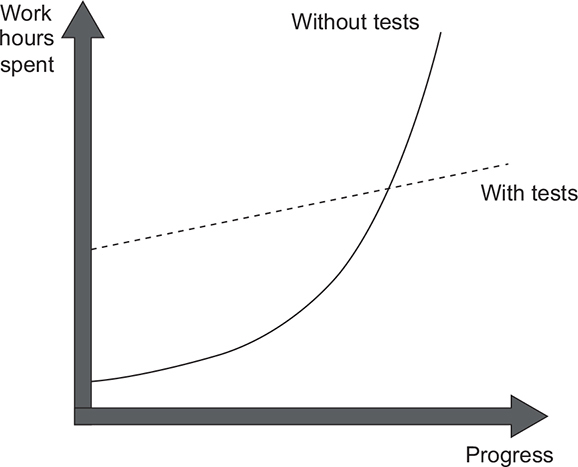
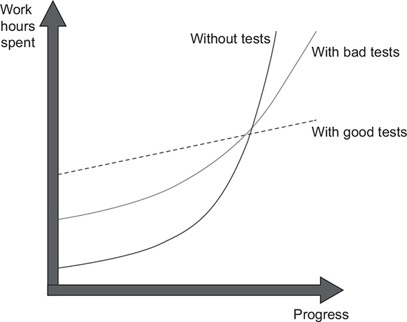

# Unit Testing Principles, Practices, and Patterns

## 1. The goal of unit testing

> What is an enterprise application?

`An enterprise application is an application that aims at automating or assisting an organization’s inner processes. It can take many forms, but usually the characteristics of an enterprise software are`

* High business logic complexity
* Long project lifespan
* Moderate amounts of data
* Low or moderate performance requirements

## The relationship between unit testing and code design

The difference in growth dynamics between projects with and without tests. A project without tests has a head start but quickly slows down to the point that it’s hard to make any progress.

This phenomenon of quickly decreasing development speed is also known as `software entropy`. In software, entropy manifests in the form of code that tends to deteriorate. Each time you change something in a code base, the amount of disorder in it, or entropy, increases.

> What makes a good or bad test?

`Although unit testing helps maintain project growth, it’s not enough to just write tests. Badly written tests still result in the same picture.`

The difference in growth dynamics between projects with good and bad tests. A project with badly written tests exhibits the properties of a project with good tests at the beginning, but it eventually falls into the stagnation phase.

## USING COVERAGE METRICS TO MEASURE TEST SUITE QUALITY

`A coverage metric shows how much source code a test suite executes, from none to 100%.`

Two most popular coverage metrics — **code coverage** and **branch coverage**

There are different types of coverage metrics, and they’re often used to assess the quality of a test suite. The common belief is that the higher the coverage number, the better.

Unfortunately, it’s not that simple, and coverage metrics, while providing valuable feedback, can’t be used to effectively measure the quality of a test suite.

> coverage metrics are a good negative indicator but a bad positive one.

### 1. Understanding the code coverage metric

`The code coverage (test coverage) metric is calculated as the ratio between the number of code lines executed by the test suite and the total number of lines in the production code base.`

### 2. Understanding the branch coverage metric

`The branch metric is calculated as the ratio of the number of code branches exercised by the test suite and the total number of branches in the production code base.`

### 3. Problems with coverage metrics

Although the branch coverage metric yields better results than code coverage, you still can’t rely on either of them to determine the quality of your test suite, for two reasons:

* You can’t guarantee that the test verifies all the possible outcomes of the system under test.
* No coverage metric can take into account code paths in external libraries.

Tip
> It’s good to have a high level of coverage in core parts of your system. It’s bad to make this high level a requirement. The difference is subtle but critical.

### 4. WHAT MAKES A SUCCESSFUL TEST SUITE?

A successful test suite has the following properties:

* It’s integrated into the development cycle.
* It targets only the most important parts of your code base.
* It provides maximum value with minimum maintenance costs.

## Summary

The only way to achieve the goal of unit testing (that is, enabling sustainable project growth) is to

* Learn how to differentiate between a good and a bad test.
* Be able to refactor a test to make it more valuable.
